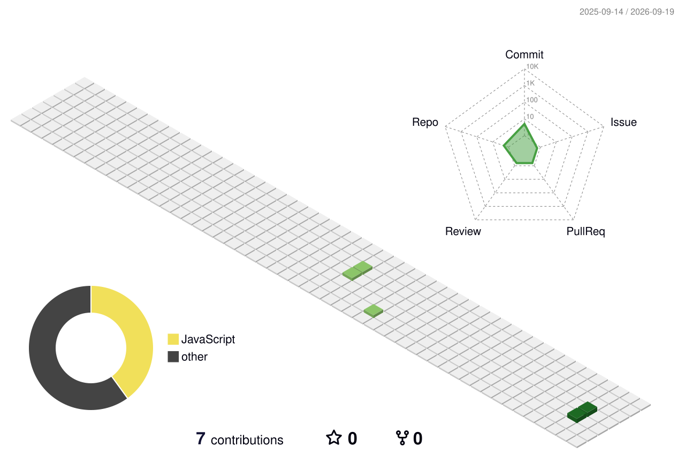

# Hi 👋, I'm Mohit Gora

### Aspiring Software Engineer | Math lover | LeetCode enthusiast

  

- 🎓 I'm a **final-year B.Tech CSE student** at IIIT Senapati, Manipur
- 🌱 I'm currently learning **AI/ML** (Python, Pandas, deep learning fundamentals) alongside DSA in C++
- 💻 I love solving problems on **LeetCode** and sharpening my math + DSA skills
- 🛠️ I build full-stack projects — recently worked on a professor-rating & analytics platform (Node.js, Express, MySQL)
- 📫 Reach me at **mohitgora950@gmail.com**

### Languages and Tools I know:

### GitHub Stats:

  
  

  

### GitHub Skyline (3D rotating contribution graph):

  <picture>
   <source media="(prefers-color-scheme: dark)" srcset="./profile-3d-contrib/profile-night-view.svg" />
<source media="(prefers-color-scheme: light)" srcset="./profile-3d-contrib/profile-green-animate.svg" />

  </picture>

### Connect with me:

<!-- Portfolio ready hone par yahan add karna: 

-->

